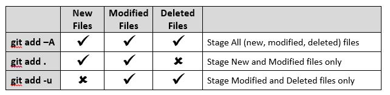

# Week 1 Notes

# CLI

- Command line interface
- File
- Directory (folder)
- Windows: Power Shell, Command Prompt, Git Bash
- MacOS: Terminal
- `pwd`= print working directory | where you are currently
- command line flags (arguments, switches)
  - can pass flags to the commands
  - flags start with `-` or `--`
  - `-` short, one letter Ex. `-l`
  - `--` verbose, whole word Ex. `--list`
- `ls` = list
  - `-l` = long list
  - `-a` = all | view hidden files and directories
- up arrow is your friend, gets you previous commands
- `cd` = change directory
  - `cd ~` = change directory to home
  - `cd dogs` = change directory to dogs
  - `cd ..` = move up one directory
  - `cd ../..` = move up two directories
- `~` = home directory
- `mkdir` = make directory
- `rm` = remove file or directory
- `rmdir` - remove directory
- `cd c:` or `cd /c/` - change directory to the root of the file system
- `touch [filename]` - create a file
- `cp [source] [destination]` - copy file or directory
- `mv [source] [destination]` - move/rename file or directory
- `cat [filename]` - displays file contents

<br/>

# GIT

- SCM - Source Control Management
- CVC - Centralized Version Control
  - there is one central copy of the repository (database)
  - lock each file and then check back into central repo
- DVC - Distributed Version Control
  - everyone has a copy of the repository (database)
  - the entire repository is being synched with the central copy
- version control for your code
- `git config` - sets/gets configuration options from configuration file for example, - `user.email, user.name`
  - `-- global` - use home/user directory config that applies to all projects
  - `--list` - lists all your current settings
    - `git --global --list` - lists all your global settings
- `git init` - initializes a repository in your current directory
  - adds a `.git` folder



## Create Repository on Github

1. github.com
1. new repo
1. make it public
1. name the repo (lowercase, dasherized)
1. include readme
1. include .gitignore for Java
1. click create

## Clone Repository to Local Computer

1. open terminal
1. cd to where you want to put the repo
1. github.com click code to get [repo url]
1. git clone [repo url]
1. cd into the repo directory/folder

## Create Java Project

1. Open IntelliJ
2. Choose name
3. Choose location (workbook-x)
4. Uncheck create repository
5. Build System: Maven
6. JDK: Amazon Corretto 17
7. Uncheck add sample code
8. Advanced Settings: GroupId: com.companyname ArtifactId:project name

## Repositories, Projects, and Classes

- workbook-x = create repository
- workbook-x or exercise-x = create project 
- exercise-x = create application class(es)


# Java

## Print

Print out to the screen. Output.

```Java
System.out.println("Hello World");

//Hello World
```

## Variable

Store information in a variable. Remember something using the computer's memory.

```java
String message = "Hello World";
System.out.println(message);

//Hello World
```

## Build String

Build a string dynamically (using variables) to display a message.

#### Example 1

```java
String firstName = "Shiraaz";
String message = "Hello ";
System.out.println(message + firstName);

// Hello Shiraaz
```

#### Example 2

```java
String firstName = "Shiraaz";
System.out.println("Hello " + firstName);

// Hello Shiraaz
```

#### Example 3

```java
String firstName = "James";
String lastName = "Bond";
System.out.println("Hello " + firstName + " " + lastName);
// Hello James Bond
```

## Format String

Build a more complicated string and format some of the dynamic variables in the string.

#### Example 1

```java
int x = 2;
int y = 2;

int sum = x + y;

System.out.println("2 + 2 = 4");
System.out.println(x + " + " + y  + " = " + sum);

//2 + 2 = 4
```

#### Example 2

```java
int x = 2;
int y = 2;

int sum = x + y;

String message = String.format("%d + %d = %d", x, y, sum);
System.out.println(message);

//2 + 2 = 4
```

#### Example 3

```java
int x = 2;
int y = 2;

int sum = x + y;

System.out.printf("%d + %d = %d", x, y, sum);

//2 + 2 = 4

```

#### Example 4

```java
int x = 2;
int y = 2;

int sum = x + y;


char operator = '+';
String message2 = String.format("%d %c %d = %d", x, operator, y, sum);
System.out.println(message2);

//2 + 2 = 4
```

#### Example 5

```java
float grossPay = 5239.77f;
System.out.printf("Gross Pay: $%.2f", grossPay);

// Gross Pay: $5239.77

```

> ### Format string type characters
>
> - `f` for a float or double (has decimal places)
> - `d` for an int or long (whole numbers)
> - `s` for string
> - `c` for character

## Input

How to accept input from the user? The user typing on their keyboard?

### String Input

```java
Scanner keyboard = new Scanner(System.in);
System.out.println("Enter first name:");
String firstName = keyboard.nextLine();
System.out.println("First Name: " + firstName);
//System.out.printf("First Name: %s", firstName);
```

### Numeric Input

```java
Scanner keyboard = new Scanner(System.in);
System.out.println("How old are you?");
int age = keyboard.nextInt();
System.out.println("Age: " + age);
keyboard.nextLine();
```

## Conditionals


## If


- `if`
- `if-else`
- `if-else-if-else`


---

### ✅ Example: `if`
```java
public class IfExample {
    public static void main(String[] args) {
        int age = 20;

        if (age >= 18) {
            System.out.println("You are an adult.");
        }
    }
}
```
💡 *Use `if` when you only want to do something **if a condition is true**, and you don't need an "otherwise."*

---

### ✅ Example: `if-else`
```java
public class IfElseExample {
    public static void main(String[] args) {
        int age = 16;

        if (age >= 18) {
            System.out.println("You can vote.");
        } else {
            System.out.println("You are too young to vote.");
        }
    }
}
```
💡 *Use `if-else` when there are **two possible outcomes** — one if the condition is true, another if it’s false.*

---

### ✅ Example: `if-else-if-else`
```java
public class IfElseIfExample {
    public static void main(String[] args) {
        int score = 85;

        if (score >= 90) {
            System.out.println("Grade: A");
        } else if (score >= 80) {
            System.out.println("Grade: B");
        } else if (score >= 70) {
            System.out.println("Grade: C");
        } else {
            System.out.println("Grade: F");
        }
    }
}
```
💡 *Use `if-else-if-else` when you have **multiple conditions** to check in order.*

---

#### Pattern

```java
if(condition){ //is true
    //execution block
    //another line?
} 
```

```java
if(condition){ //is true
    //execution block
    //another line?
} else {
    //otherwise execution block
    //another line?
}
```


```java
if(condition){ //is true
    //execution block
    //another line?
} else if(another condition) {
    //otherwise execution block
    //another line?
} else if(another condition) {
    //otherwise execution block
    //another line?
}else{
  //execution block if none of the conditions are true
}
```


## Switch

#### If that would be better as switch
```java
public class DayMessage {
    public static void main(String[] args) {
        String day = "Tuesday";

        if (day.equals("Monday")) {
            System.out.println("Start of the work week.");
        } else if (day.equals("Tuesday")) {
            System.out.println("Second day grind.");
        } else if (day.equals("Wednesday")) {
            System.out.println("Midweek hustle.");
        } else if (day.equals("Thursday")) {
            System.out.println("Almost there!");
        } else if (day.equals("Friday")) {
            System.out.println("Weekend is near.");
        } else {
            System.out.println("It's the weekend!");
        }
    }
}

```

#### Equivalent Switch

```java
public class DayMessage {
    public static void main(String[] args) {
        String day = "Tuesday";

        switch (day) {
            case "Monday":
                System.out.println("Start of the work week.");
                break;
            case "Tuesday":
                System.out.println("Second day grind.");
                break;
            case "Wednesday":
                System.out.println("Midweek hustle.");
                break;
            case "Thursday":
                System.out.println("Almost there!");
                break;
            case "Friday":
                System.out.println("Weekend is near.");
                break;
            default:
                System.out.println("It's the weekend!");
                break;
        }
    }
}


```


